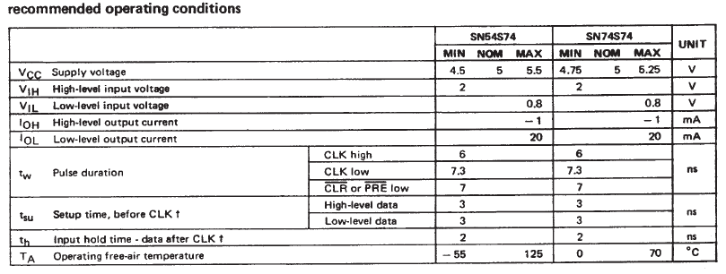
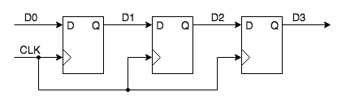
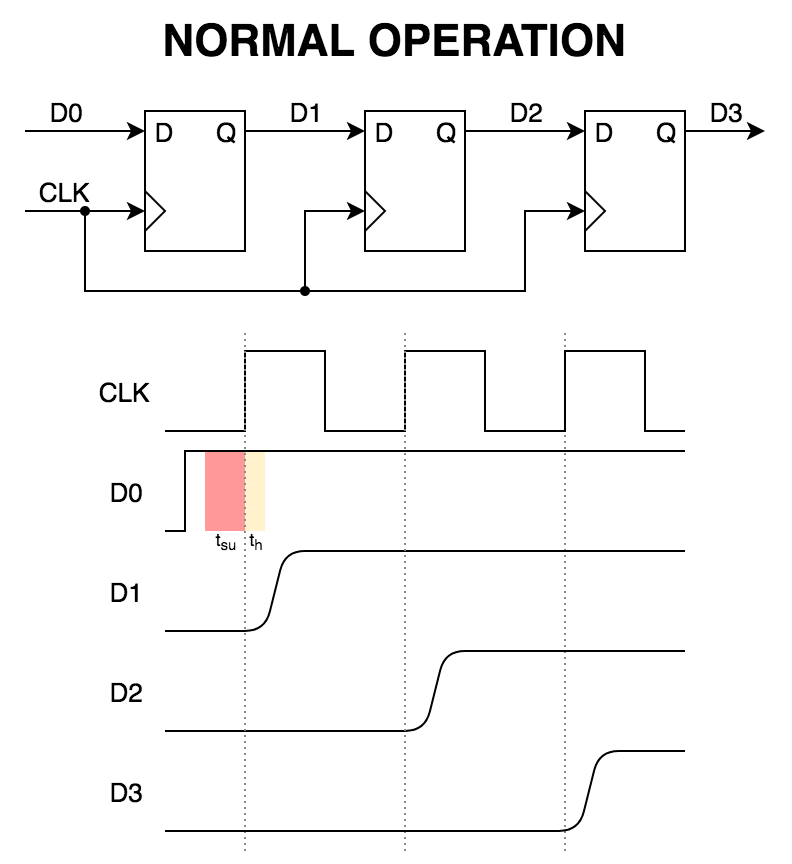
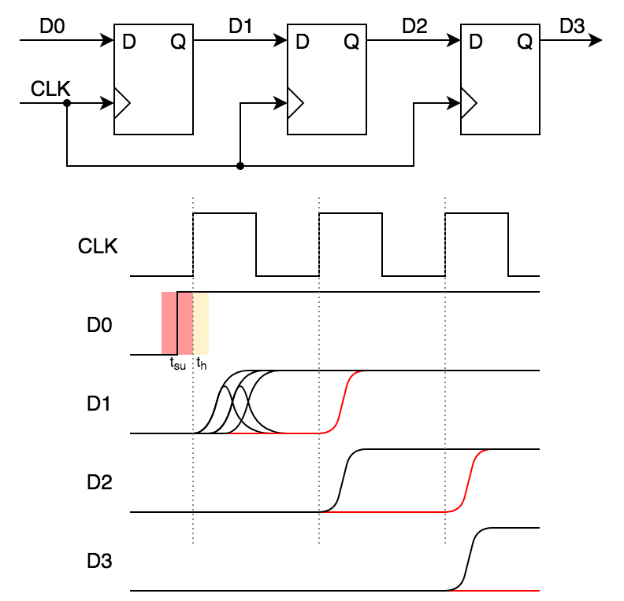
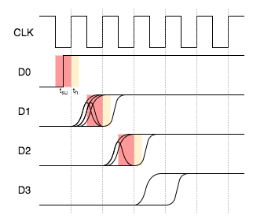

#HSLIDE

## Lab 2 Review

Note:
Lab 2 Questions, Issues, Feedback?

#HSLIDE

## Metastability

#HSLIDE

## Metastability Demo

#HSLIDE

### SN74S74 Datasheet Parameters

#HSLIDE

### Synchronizer Register Chain

Note:
Typical synchronizer chain length is 2 or 3 registers.
Faster clock rates need longer chains due to metastability bleed though which is shown in the Faster Clock slide.

#HSLIDE

### Normal Operation

#HSLIDE

### Data tsu Violation

#HSLIDE

### Faster Clock

#HSLIDE

## MTBF

mean time between failures

