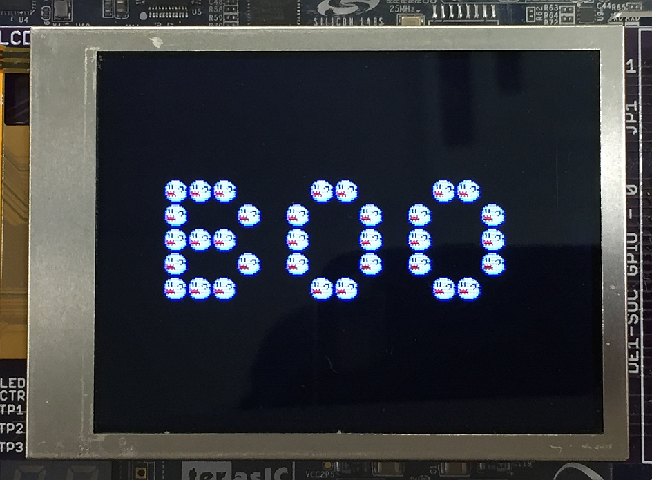

---

# Lab 7 Questions

Note:
Lab 7 Questions, Issues, Feedback?

---

## Verilog Signed Math

```verilog
wire signed [15:0] a, b;
wire signed [31:0] q;

assign q = a * 16'sh0123 + b * 16'sh8123;
```

---

## Test Bench Structures

---

## LCD Panel



---?image=https://raw.githubusercontent.com/CWRU-EECS301-Sum17/syllabus/master/Lectures/Lecture09/Slides/images/FPGA_to_LCD_Communications.png&size=90% auto

---?image=https://raw.githubusercontent.com/CWRU-EECS301-Sum17/syllabus/master/Lectures/Lecture09/Slides/images/LCD_HSYNC_TimingDiagram.png&size=90% auto

---?image=https://raw.githubusercontent.com/CWRU-EECS301-Sum17/syllabus/master/Lectures/Lecture09/Slides/images/LCD_VSYNC_TimingDiagram.png&size=90% auto


---

# Lab 8 Overview

---?image=https://raw.githubusercontent.com/CWRU-EECS301-Sum17/syllabus/master/Lectures/Lecture09/Slides/images/Lab8-DevBoardLayout.png&size=auto 90%


---

