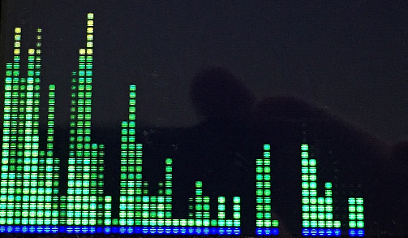
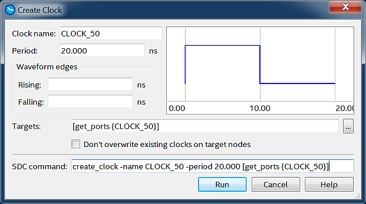

# EECS301

## Lecture 13

### 12/1/2017

---

# Lab 10 Questions

Note:
Lab 10 Questions, Issues, Feedback?

---

## Lab 10 Demo



---

### Computation Pipelines

* FPGA logic is massively parallel
* Computational pipelining takes advantage of parallelism
* CPUs, GPUs, and DSPs have highly optimized but fixed pipelines
* FPGA pipelines can be fully customized per application

Note:
The pipelines in CPUs, GPUs, and DSPs are designed for a specific task and may outperform an FPGA by increasing the clock rates past an FPGAs limit.
FPGAs offer complete flexibility in the pipeline logic and multiple pipeline instances can increase the total throughput.

---?image=https://raw.githubusercontent.com/CWRU-EECS301-Sum17/syllabus/master/Lectures/Lecture13/Slides/images/Pipeline_Example.png)

---

### Quartus Timing Constraints

* Timing constraints insure the propagation delay times between registers are valid
* The Synthesizer places logic using the timing constraints
* Over-constraining a design causes longer compile times 
* Every signal in a design must have a constraint

* Quartus uses the `.sdc` file extension for constraints files
* Every lab project has had a constraints file (so refer back to previous labs for examples)
* Refer to this [User Guide](http://www.alterawiki.com/uploads/3/3f/TimeQuest_User_Guide.pdf) for detailed information about setting constraints in Quartus

---

### Clock Constraints

* In synchronous designs all signals reference a Clock signal
* Providing the clock constraint is critical
* The clock constraint covers most of the signals in the design
* The DE1-SoC board's main clock input is 50 MHz

```
create_clock -name {CLOCK_50} -period 20.000 [get_ports {CLOCK_50}]
```

Note:
The clock name does not have to be the same as the port name.
All signal names are case-sensitive

---

### Quartus Constraints GUI

* Graphical interface to set and review timing constraints



---


---


---


---


---

# Questions


